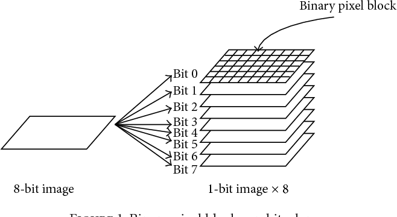
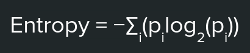

# BPCS-Steganography Presentation
William Haratsch and Logan Tom

## Introduction
BPCS-Steganography stands for Bit-plane Complexity Segmentation Steganography. This digital steganography method was invented in 1998 by Eiji Kawaguchi and Richard O. Eason and is detailed in their paper titled "Principle and applications of BPCS-Steganography." This led to the development of the Qtech Hide & View BPCS-Steganography tool, which can perform both embedding and extracting operations. More information on this tool can be found [here](http://datahide.org/BPCSe/QtechHV-program-e.html). One of BPCS-Steganography's main advantages is its relative obscurity as a data embedding method, as Steghide and Stegsolve don't account for BPCS data- and image-manipulation techniques. Since the original invention of BPCS-Steganography, researchers are focused on improving the BPCS algorithm and decreasing the ability to detect the method's use.

## Bit planes
A bit plane is essentially one eighth of the image where you take off each bit using the 0 or 1 value for black and white and create an image off those values. If the red value is 01100100 the bit plane values for this is\
First: 0\
Second: 1\
Third: 1\
Fourth: 0\
Fifth: 0\
Sixth: 1\
Seventh: 0\
Eighth: 0\
and each plane is made up of these values for the color instead of the original 01100100. 
Below is a visual example

As you can see in the example, the lower the bitplane number the more impact on the image and thus resembles the image more. The last few bit planes only add one to the colors so they appear more like noise and are random.
## How we use bit planes in BPCS-Steganography
Essentially what BPCS steganography does is check each bit plane within a pixel and compare its binary data to that of its surrounding neighbors, computing a complexity value for each bit plane essentially by comparing colors. If the pixel bit plane is complex enough, the algorithm will mark it as eligible to store data and data will be stored inside the pixel. This is because the change would not seem as drastic and would thus be harder to notice to the human eye. 

## Role of Visual Illusions in BPCS-Steganography
The brain's visual system is more sensitive to large-scale patterns and less sensitive to small-scale noise. The effect being that a human will not be able to perceive a too-complex visual pattern for what it is, and no defnitive shape can be perceived from the complex visual pattern. BPCS takes advantage of this property of the human brain by replacing complex areas of a vessel image's bit plane with embedded hidden data (which is also composed of complex patterns). The result is a modified image which appears identical to the human eye.

## Basic Rundown of BPCS-Steganography Algorithm

1. The given image is separated into a grid of blocks.
    * Each block is of a given size.
2. Iterate through the bit planes of each block in the image, until the last block.
3. As you iterate through each bit plane, assign a complexity/entropy value between 0 and 1 to each bit plane using a complexity function.
    * The closer the assigned value is to 1, the more complex the bit plane is.
    * Increasing block size increases the size of the data that the bit plane in question is compared with.
4. Reiterate through each bit plane, this time using a predetermined complexity threshold value between 0 and 1 to decide whether or not to encrypt the data in the bit plane.
    * The closer the threshold value is to 1, the higher the standards are for data embedding. If the threshold value is closer to 0, the visual artifacts in the modified image may be more visually apparent.
    * You can choose the max bit plane for which data will be embedded into the vessel image. Note that there are 8 bit planes. Increasing the max bit plane will increase the visual distortion of the modified image.
### Complexity Function

* This function keeps track of the frequencies of each bit value (0 or 1) within a bit plane to come up with a complexity value in the range of (0, 1).
## Advantages and Disadvantages of BPCS-Steganography
### Advantages of BPCS
* Changing complex sections of bit planes allows us to store more data within images compared to LSB, which is only able to alter 1/8th of each pixel.
* Using complex bit planes and an entropy calculation function for each bit plane adds an extra layer of security to the digital steganography. Without knowing the exact entropy function used to decide which bit plane sections are complex and which aren't, it is difficult for outsiders to detect and extract the hidden data.
* BPCS is very flexible in that many parameters can be changed depending on one's use case. This also makes it more difficult for outsiders to detect and extract the hidden data because you will more than likely need all the encoding presets before decoding.
### Disadvantages of BPCS
* Decreasing the block size means there will more blocks to iterate through and thus more bit planes for which the entropy function must be utilized. This means that BPCS will be more time-consuming when quicker methods exist.
* BPCS-Steganography is vulnerable to statistical analysis detection methods which detect anomalies in image bit planes.
* The effectiveness of the BPCS algorithm hinges on the complexity of the vessel image. If the vessel image is too simplistic, not much data will be embedded and the changes in the modified image will be more visually apparent.

## Noise Map encryption
Noise maps are functions which generate seemingly random values consistently given a seed. This lets us encode and decode our data based off certain noise values. The encode algorithm should be something reversible given a key which the noise map generates for each pixel. We used a simple XOR function at first to do so. To solve the issue of not knowing the seed we stored the noise map seed in the first few pixels of the image. 
Below is an image of a noise map:

  

While this image seems very random it is actually replicable and with the correct seed the exact map is recreated.
## Relationship between BPCS-Steganography and Noise Maps
The noise-like nature of the complex regions in the bit planes ensures that any modifications do not produce human-visible patterns or artifacts. In this sense, the seemingly randomized distribution of embedded data throughout the image is a shared aspect of BPCS-Steganography and noise-map encryption, even when it is not randomized but is instead according to a pre-determined BPCS entropy function or noise function.
# Our Project
Our project uses both BPCS steganography and Noise maps to encrypt data and saves it in an image file of your choosing. This data can be extracted and either printed or saved as an image. 
## Modifying images
Using the modify image method and passing the image to be modified, data(as file or String), and the noise map seed will convert the data into an array which is to be encrypted
Then it encrypts the data using the seed and stores the data in the image using BPCS.
What the user will see is a screen of the modified image. Then pressing `space bar` will allow you to go through the image checking the different pixels and either highlighting them or showing them as a black and white screen.
The modified image will be stored in `modifiedImage.png` and can be accessed there. 
You are also able to use the `r`, `g`, and `b` keys to view the bit planes of those colors and try to see how much they were altered and where they were altered through the steganography.
## Decoding images
There are multiple ways to attempt to decode images encoded with BPCS-Steganography. Here is one method:

1. Divide the image into non-overlapping blocks of the size given when encoding.
2. Iterate through each bit plane of each image block, calculating and assigning bit plane complexities as you go. 
    * Make sure to use the same complexity function as was used during encoding.
3. Compare bit plane complexities to the threshold value which was determined when encoding.
    * Bit planes with a complexity value above this threshold are considered to contain embedded data.
4. For bit planes considered to contain embedded data, extract the bits from these blocks and resassemble the data.

Note that a flaw with this method is that when embedding the image data into a bit plane, it's not certain that the altered bit plane is still above the complexity threshold.S